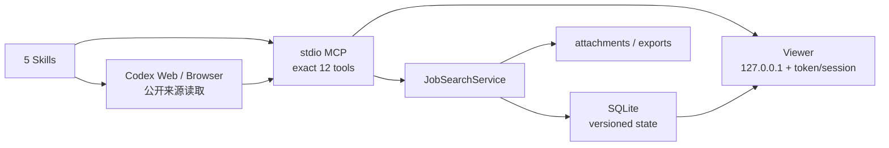

# 架构（Architecture）

## 分层职责

- Skills：确认用户意图、来源纪律、事实/推断/未知标记和阶段交接，不直接写数据库。
- Codex Web/Browser：只读取允许访问的公开页面；社交/聚合结果只能成为 discovery lead。
- MCP：单个 stdio bundle 暴露且仅暴露 12 个 tools：`workspace_open`、`resume_import`、`profile_commit`、`search_run_begin`、`search_record_batch`、`search_run_finish`、`opportunities_query`、`feedback_record`、`application_packet_upsert`、`application_packet_review`、`workspace_export`、`viewer_open`。
- Core：Zod 输入边界、版本冲突、workspace 隔离、证据状态、去重 alias、字段分级、公共 recovery projection 与 SQLite transaction。
- Viewer：调用 Core 公共方法，不打开 SQLite；只显示脱敏 DTO，没有 submit route。

## 版本、恢复与证据

Candidate profile、search brief 与 preference 使用单调版本；search run 固定绑定其启动时版本，旧 run 不会被新偏好重写。SQLite migrations 顺序记录在 `schema_migrations`；数据库版本高于当前程序时拒绝打开。

Opportunity 通过 canonical URL、requisition ID 与保守 fallback key 去重，并保留历史 alias。每次 source observation 都保留来源、状态和时间；最新官方证据决定当前状态，官方冲突保持为 `conflict`。Recovery snapshot 只返回恢复工作流所需的公共字段，不含简历全文、原始 application values、凭据或本机路径。

Trace 仅保留用户可见的动作证据与固定 allowlist，不保存 hidden reasoning。Query failure 用 `runId` 精确关联；敏感字符串、联系方式、token 和路径在公共边界脱敏。

## 数据目录

默认 data root 见 [PRIVACY.md](../PRIVACY.md)。根下包含 `job-search.sqlite` 与 `workspaces/<workspace-id>/attachments`、`workspaces/<workspace-id>/exports`。生成路径必须位于 data root，拒绝 traversal、symlink escape 与覆盖已有文件。

Release 把 esbuild 的单入口 Node bundle 放在 `dist/mcp/index.js`，Vite 静态资源放在相邻的 `dist/static/`。Viewer 从 `import.meta.url` 相对定位静态目录，因此安装后的插件不依赖源码树或调用者 cwd。
