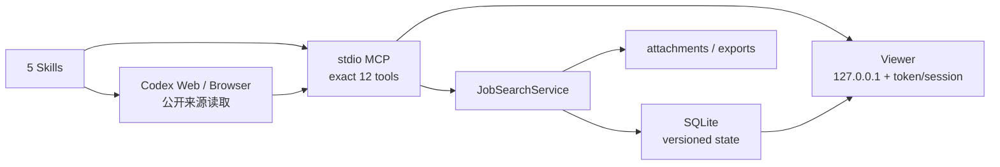

# 架构（Architecture）

## 分层职责

- Skills：确认用户意图、来源纪律、事实/推断/未知标记和阶段交接，不直接写数据库。
- Codex Web/Browser：只读取允许访问的公开页面；社交/聚合结果只能成为 discovery lead。
- MCP：单个 stdio bundle 暴露且仅暴露 12 个 tools：`workspace_open`、`resume_import`、`profile_commit`、`search_run_begin`、`search_record_batch`、`search_run_finish`、`opportunities_query`、`feedback_record`、`application_packet_upsert`、`application_packet_review`、`workspace_export`、`viewer_open`。
- Core：Zod 输入边界、版本冲突、workspace 隔离、证据状态、去重 alias、字段分级、公共 recovery projection 与 SQLite transaction。
- Viewer：调用 Core 公共方法，不打开 SQLite；只显示脱敏 DTO，没有 submit route。

## 版本、恢复与证据

Candidate profile、SearchBrief 与 preference 使用单调版本。两处定位都使用同一个严格、version-1 `TargetingConstraints` contract：Profile 保存最新可复用的定位事实；SearchBrief 保存该 run 的完整不可变 snapshot（target kind、employment type、level、domain、availability、work authorization/visa、timing、hard exclusions、breadth、unknowns/contradictions）。`confirmed`、`unknown`、`contradiction` 各有状态一致性校验；旧记录安全迁移为显式 unknown/default，不重新推断。Viewer 与 recovery 显示真实 snapshot。

Search run 固定绑定启动时的 profile/SearchBrief/preference 版本，状态只能从 `running` 单向进入 `completed` 或 `failed`。关闭后所有 batch、finish 重试与 run-bound trace 都在事务内拒绝。SQLite migrations 顺序记录在 `schema_migrations`；数据库版本高于当前程序时拒绝打开。

Opportunity 通过 canonical URL、requisition ID 与保守 fallback key 去重，并保留历史 alias。每个 query attempt、source observation、match assessment 与 dedupe decision 都持久化精确 `runId`；query 还保留结构化 outcome/failure，observation 保留 exact locator、tier、confidence、deadline、retrieved-at 与 conflict。`opportunities_query.runId` 按历史 run 重算证据状态并返回该 run 的 assessment identity，不把新旧 scope 混合。Recovery snapshot 公开完整可恢复失败与来源 provenance，但不含简历全文、原始 application values、凭据或本机路径。

Trace 仅保留用户可见的动作证据，不保存 hidden reasoning。任意嵌套 `password`、`secret`、`credential`、`apiKey`、`privateKey`、`session` 子树在持久化前清除；敏感字符串、联系方式、token、URL 和本机路径在公共 recovery/Viewer 边界再次脱敏。

## 数据目录

默认 data root 见 [PRIVACY.md](../PRIVACY.md)。根下包含 `job-search.sqlite` 与 `workspaces/<workspace-id>/attachments`、`workspaces/<workspace-id>/exports`。生成路径必须位于 data root，拒绝 traversal、symlink escape 与覆盖已有文件。

Release 把 esbuild 的单入口 Node bundle 放在 `dist/mcp/index.js`，Vite 静态资源放在相邻的 `dist/static/`。打包门禁读取 esbuild metafile inputs 与 Vite/Rollup module IDs：repo-local 输入必须由 git tracked，只有精确 virtual/generated IDs 与 `node_modules` 路径可例外；untracked transitive import 直接失败。文本型 PDF 由 bundle 内的纯 JavaScript parser 处理，不需要 Canvas/native binding。Viewer 从 `import.meta.url` 相对定位静态目录，因此安装后的插件不依赖源码树、调用者 cwd 或外部 `node_modules`。
